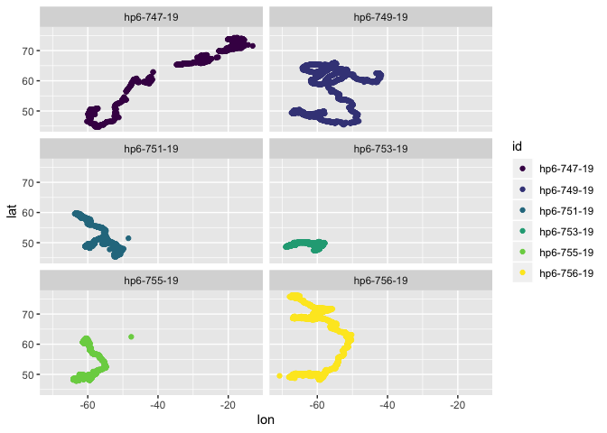
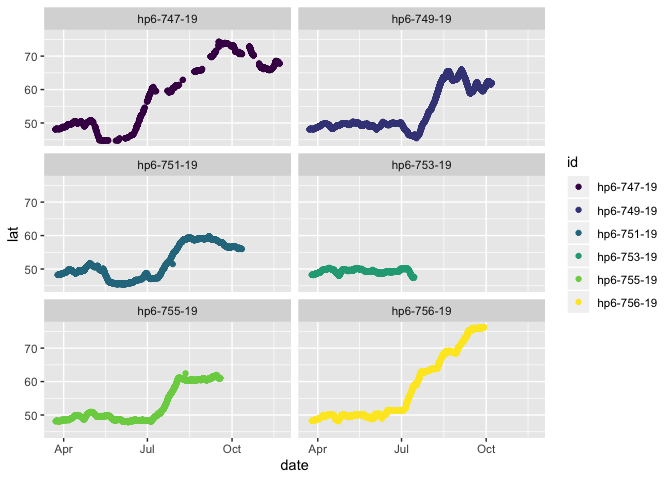
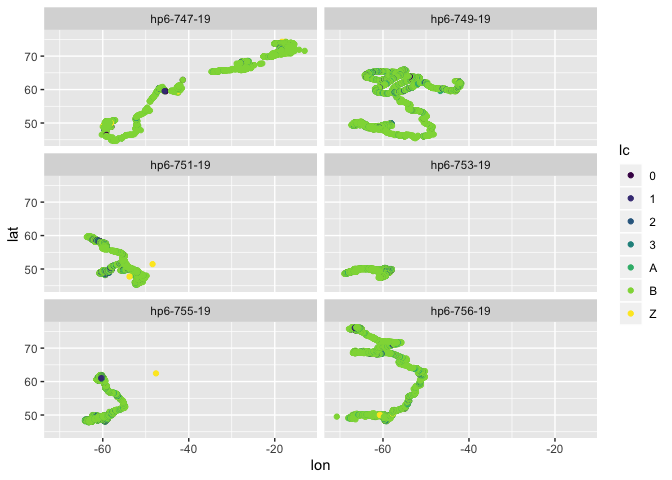
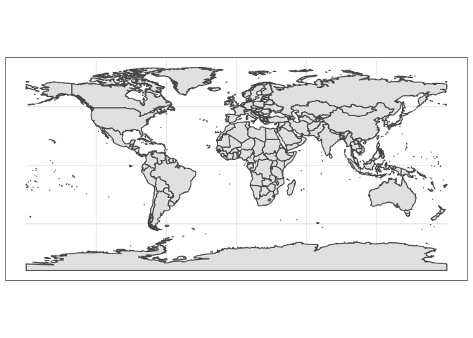
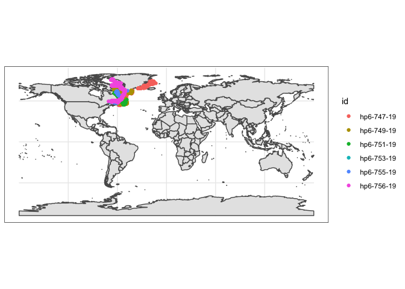
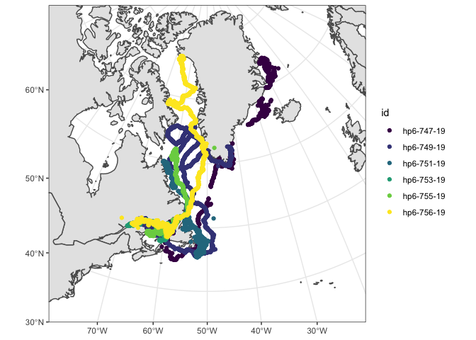
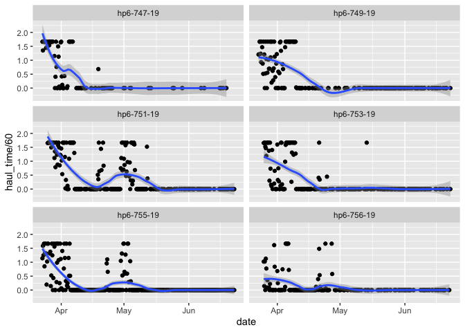
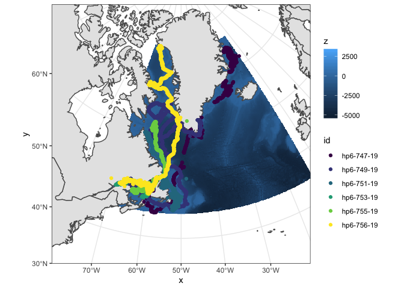

<!-- README.md is generated from README.Rmd. Please edit that file -->

------------------------------------------------------------------------

### Introduction

The aim of this practical is to give you an understanding of the common
appraches that are used to process and analyse animal movement data. We
will be doing this in the `R` statistical framework and will introduce
you to some commonly used `R` packages.

During this practical you will:

1.  Load in an example location dataset and explore the data with some
    preliminary plots
2.  Produce a map of the study area in an appropriate spatial projection
    for the region
3.  Load in an example dive summary dataset and explore the data with
    some preliminary plots
4.  Regularise animal location data and combine them with dive summary
    data
5.  Extract example environmental covariates from the regions the animal
    utilises and append them to the data frame  
6.  Perform a preliminary statistical analysis to better understand the
    drivers of animal movement

This practical will be based on the `tidyverse` style of `R` coding. You
will become familiar with using pipes `%>%` to perform data
manipulations, using `ggplot` to generate publication quality figures,
and using the `sf` package to handle spatial data.

For more information on the `tidyverse` check out the Wickham &
Grolemund book ‘R for Data Science’. You can access it for free online
here:  
<a href="https://r4ds.had.co.nz" class="uri">https://r4ds.had.co.nz</a>

The project website can be accessed here:  
<a href="https://www.tidyverse.org" class="uri">https://www.tidyverse.org</a>

For more information on the `sf` project check out
<a href="https://r-spatial.github.io/sf/" class="uri">https://r-spatial.github.io/sf/</a>

This practical will require that you have first downloaded and installed
the following R packages: `tidyverse`, `rnaturalearth`, `sf`, `viridis`
`lubridate` `foieGras` `marmap` `raster`…

------------------------------------------------------------------------

### Background

In March 2019 I was part of an expedition to deploy SMRU SRDL devices on
harp seal pups in the Gulf of St Lawrence, Canada. Harp seals give birth
on the sea ice when it is at it’s most southerly extent in late Winter/
early Spring. The females wean the pups after around 2 weeks, and the
pups start to enter the water and feed for themselves approximately 2
weeks after weaning. We deployed tags on 12 pups that were approximately
3 weeks old, and tracked their movements as they left the sea ice and
began their first migration north.

Most of the tags have now stopped transmitting, but you can see a map of
the raw unfiltered location data here:  
<a href="https://jamesgrecian.shinyapps.io/harpmap/" class="uri">https://jamesgrecian.shinyapps.io/harpmap/</a>

   

<figure>
<figcaption>Harp seal pup with SMRU SRDL. Gulf of St Lawrence March 2019</figcaption>
</figure>

   

------------------------------------------------------------------------

### Data

SMRU Satellite Relay Data Loggers collect a wide range of information
and transmit the data through the Argos satellite network. In this
practical we will be considering the location data and the dive summary
data.

Data for 6 of these animals are available to you via github, you can
load this straight into `R` using the `read_csv` command:

`locs <- read_csv(url("https://raw.githubusercontent.com/jamesgrecian/BL5122-dev/master/data/hp6_diag.csv"))`
`dives <- read_csv(url("https://raw.githubusercontent.com/jamesgrecian/BL5122-dev/master/data/hp6_summary.csv"))`

The `locs` data frame is the “diag” data from the tags. This has columns
containing information on the animal id, the date and time of the fix,
the estimated quality of the argos location, the estimated longitude and
latitude, as well as information on the error ellipses from the Argos
Kalman Filter (a more detailed measure of the location quality).

The `dives` data frame is the “summary” data from the tags and contains
6 hourly summary information for all the dives performed by an
individual. Some of the information has been truncated for this
practical, but there are columns containing the start time of the 6 hour
period, the proportion of time an individual spent at the surface,
diving, or hauled out, the number of dives finished during the period,
the average dive depth, maximum dive depth, average dive duration and
maximum dive duration.

For more information on the data collected by the tags see here:  
<a href="http://www.smru.st-andrews.ac.uk/protected/specs/DatabaseFieldDescriptions.pdf" class="uri">http://www.smru.st-andrews.ac.uk/protected/specs/DatabaseFieldDescriptions.pdf</a>

------------------------------------------------------------------------

### Task 1: Load in example location data and explore

#### Task

Use the `read_csv` function from the `tidyverse` series of packages to
load the location dataset into R.

You can look at the top 10 rows of the dataframe by typing the object
name: `locs`, you can look at a summary of the dataframe by typing
`summary(locs)`.

Generate some preliminary plots to explore the data, try plotting using
the `ggplot` command. Have a look at the help file by typing `?ggplot`

If you haven’t used `ggplot` before, it is based on “The Grammar of
Graphics”. Have a look at the tidyverse help page, it has some great
cheat sheets:
<a href="https://ggplot2.tidyverse.org" class="uri">https://ggplot2.tidyverse.org</a>

Every plot (even a map) has the same building blocks; a data set,
coordinate system, and aesthetics. For example here is a simple plot of
the longitude and latitude data from the tag dataset:

`ggplot() + geom_point(aes(x = lon, y = lat), data = locs)`

Use this code to plot the migratory paths of the animals using the `lon`
and `lat` column from the SRDL diag data. Try using the `facet_wrap`
command to generate seperate plots for each animal (the id column).

Try plotting other parts of the `locs` dataframe, what patterns do you
see emerge?

Can you generate a plot to illustrate when the animals begin their
northward migration? Try plotting latitude against time.

Can you identify gaps in the data, or poor quality locations due to
issues with satellite coverage? Perhaps colour the locations using the
`lc` column.

How long do the tags last? Can you generate a summary table? Have a look
at `?dplyr::summarise` for some help

#### Code

    require(tidyverse)

    # load in the data
    locs <- read_csv(url("https://raw.githubusercontent.com/jamesgrecian/BL5122-dev/master/data/hp6_diag.csv"))

    locs # check the data

    summary(locs) # generate a summary

    # lon lat plot coloured by animal id
    p1 <- ggplot() +
      geom_point(aes(x = lon, y = lat, colour = id), data = locs) +
      scale_color_viridis_d() +
      facet_wrap(~id, nrow = 3)
    print(p1)

    # change in lat through time
    p2 <- ggplot() +
      geom_point(aes(x = date, y = lat, colour = id), data = locs) +
      scale_color_viridis_d() +
      facet_wrap(~id, nrow = 3)
    print(p2)

    # lon lat plot coloured by argos location class
    p3 <- ggplot() +
      geom_point(aes(x = lon, y = lat, colour = lc), data = locs) +
      scale_color_viridis_d() +
      facet_wrap(~id, nrow = 3)
    print(p3)

    # how long do the tags last?
    locs %>% 
      group_by(id) %>% 
      summarise(max(date) - min(date)) 

#### Answer

    ## # A tibble: 21,502 x 8
    ##    id         date                lc      lon   lat  smaj  smin   eor
    ##    <chr>      <dttm>              <chr> <dbl> <dbl> <dbl> <dbl> <dbl>
    ##  1 hp6-747-19 2019-03-23 00:08:33 3     -59.6  48.1   269    93    97
    ##  2 hp6-747-19 2019-03-23 00:25:33 3     -59.6  48.1   338    75    69
    ##  3 hp6-747-19 2019-03-23 00:37:38 1     -59.6  48.1  4984   144    83
    ##  4 hp6-747-19 2019-03-23 10:20:14 3     -59.7  48.2   358    89   116
    ##  5 hp6-747-19 2019-03-23 10:22:18 3     -59.7  48.2   239    82    96
    ##  6 hp6-747-19 2019-03-23 15:07:47 2     -59.7  48.2  1345    76   132
    ##  7 hp6-747-19 2019-03-23 15:36:07 3     -59.7  48.2   665    48    90
    ##  8 hp6-747-19 2019-03-23 20:03:42 B     -59.7  48.2  4369   528    42
    ##  9 hp6-747-19 2019-03-23 20:13:27 2     -59.7  48.3  1890    72    84
    ## 10 hp6-747-19 2019-03-24 01:25:02 3     -59.7  48.3   271    70    82
    ## # … with 21,492 more rows

    ##       id                 date                          lc           
    ##  Length:21502       Min.   :2019-03-23 00:02:21   Length:21502      
    ##  Class :character   1st Qu.:2019-05-22 08:30:23   Class :character  
    ##  Mode  :character   Median :2019-07-18 00:56:36   Mode  :character  
    ##                     Mean   :2019-07-12 07:13:21                     
    ##                     3rd Qu.:2019-08-30 17:45:37                     
    ##                     Max.   :2019-11-21 20:32:37                     
    ##       lon              lat             smaj             smin       
    ##  Min.   :-70.74   Min.   :44.70   Min.   :     0   Min.   :     9  
    ##  1st Qu.:-62.30   1st Qu.:49.43   1st Qu.:  2476   1st Qu.:   108  
    ##  Median :-59.69   Median :52.53   Median :  5274   Median :   410  
    ##  Mean   :-57.49   Mean   :56.00   Mean   : 15894   Mean   :   842  
    ##  3rd Qu.:-55.68   3rd Qu.:60.98   3rd Qu.: 11815   3rd Qu.:   920  
    ##  Max.   :-13.04   Max.   :76.27   Max.   :986216   Max.   :288529  
    ##       eor        
    ##  Min.   :  0.00  
    ##  1st Qu.: 78.00  
    ##  Median : 89.00  
    ##  Mean   : 88.87  
    ##  3rd Qu.: 99.00  
    ##  Max.   :180.00

    ## # A tibble: 6 x 2
    ##   id         `max(date) - min(date)`
    ##   <chr>      <drtn>                 
    ## 1 hp6-747-19 243.8500 days          
    ## 2 hp6-749-19 197.8026 days          
    ## 3 hp6-751-19 199.9178 days          
    ## 4 hp6-753-19 111.0021 days          
    ## 5 hp6-755-19 178.7776 days          
    ## 6 hp6-756-19 187.0016 days

------------------------------------------------------------------------

### Task 2: Produce a map of the study area

#### Task

Using the `sf` package alongside `ggplot2` and the `tidyverse` it is
possible to generate publication quality maps in R.

You will need to download an appropriate shapefile of the world to add
to the map. Have a look at the `rnaturalearth` package. You can generate
a plot of the shapefile using the `geom_sf` function.

Once you had generated a simple map, try adding the animal location
data. To do this you will need to add projection information to the
location dataframe.

You can do this using the `st_as_sf` and `st_set_crs` commands from
`sf`. Latitude and Longitude information is typically referred to as
WGS84 or CRS code 4326

For more information have a look at the epsg.io website:
<a href="https://epsg.io" class="uri">https://epsg.io</a>

Harp seals are an Arctic species, so the WGS84 projection means it is
hard to see what is going on. We can change the projection of the map to
remove some of this distortion.

Think about what projection may be appropriate and try adding it to the
plot using the `coord_sf` command.

#### Code

    require(sf)
    #install.packages("rnaturalearth")
    #install.packages("rnaturalearthdata")
    require(rnaturalearth)

    # Generate a global shapefile and a simple plot
    world <- ne_countries(scale = "medium", returnclass = "sf")

    p4 <- ggplot() +
      theme_bw() +
      geom_sf(aes(), data = world)
    print(p4)

    # Create an sf version of the locs data with a WGS84 projection and add to the plot
    locs_sf <- locs %>% st_as_sf(coords = c('lon', 'lat')) %>% st_set_crs(4326)

    # Add the locations to the WGS map
    print(p4 + geom_sf(aes(colour = id), data = locs_sf, show.legend = "point"))

    # To generate a plot with less distortion first define a projection i.e. Lambert Azimuthal Equal Area
    prj = "+proj=laea +lat_0=60 +lon_0=-50 +x_0=0 +y_0=0 +datum=WGS84 +units=m +no_defs +ellps=WGS84 +towgs84=0,0,0"

    p5 <- ggplot() +
      theme_bw() +
      geom_sf(aes(), data = world) +
      coord_sf(crs = prj) +
      geom_sf(aes(colour = id), data = locs_sf, show.legend = "point") +
      scale_color_viridis_d() +
      coord_sf(xlim = c(-2500000, 2500000), ylim = c(-2500000, 2500000), crs = prj, expand = T) +
      scale_x_continuous(breaks = seq(from = -130, to = 30, by = 10))
    print(p5)

#### Answer

------------------------------------------------------------------------

### Task 3: Load in an example dive summary dataset and explore

#### Task

Load in the dive summary data and generate some preliminary plots to
visualise the data.

This data is transmitted via the Argos system, do we have all the 6 hour
summary data from all the tags or are there gaps in transmission?

These animals were tagged as newly weaned pups, can you see changes in
their diving behaviour over time?

Try plotting different dive parameters as a time series using `ggplot`

#### Code

    dives <- read_csv(url("https://raw.githubusercontent.com/jamesgrecian/BL5122-dev/master/data/hp6_summary.csv"))

    #how many dive records do we have?
    dives %>% group_by(id) %>% tally()

    p6 <- ggplot() +
      geom_point(aes(x = date, y = haul_time/60),
                 data = dives %>% filter(date < "2019-06-23")) +
      geom_smooth(aes(x = date, y = haul_time/60),
                  formula = "y ~ x", method = "loess", span = 0.5,
                  data = dives %>% filter(date < "2019-06-23")) +
      facet_wrap(~id, nrow = 3)
    print(p6)

#### Answer

    ## # A tibble: 6 x 2
    ##   id             n
    ##   <chr>      <int>
    ## 1 hp6-747-19   233
    ## 2 hp6-749-19   595
    ## 3 hp6-751-19   586
    ## 4 hp6-753-19   290
    ## 5 hp6-755-19   676
    ## 6 hp6-756-19   562

------------------------------------------------------------------------

### Task 4: Regularise location data and combine with dive summary data

#### Task

If we want to explore how the dive behaviour of these animals changes as
they migrate we need to link the surface movements to the dive summary
data.

However, if you look at the time stamps of both the datasets they do not
match:  
`head(locs$date)`  
`head(dives$date)`

This is because, while the dive data are summarised regularly, the
location data are only collected when a satellite passes overhead and
the animal is at the surface.

It is common practice to remove erroneous fixes and regularise the
location data before conducting statistical analysis. We can do this
using a type of state space model known as a random walk filter.

This can be fitted very quickly using the new foieGras package. Have a
look at the help file by typing `browseVignettes(package = "foieGras")`

You will need to generate a sequence of times that you want the model to
estimate locations for. Add these to the `time.step` argument in the
`fit_ssm` command.

Once you have run the model (which will take a few minutes), extract the
predicted locations using the `grab` command.

This should give you a table of locations that match the time stamps in
the dive data. Combine the columns from these two datasets using the
`left_join` command. The output should be a dataframe containing animal
id, datetime, lon, lat and the dive summary data.

#### Code

    require(lubridate)
    require(foieGras)

    # Create a regular series of datetimes that can be matched to the dive data
    # These will be at 6 hour intervals starting at midnight
    times <- locs %>% group_by(id) %>% summarise(min = floor_date(min(locs$date), "6 hours"),
                                                 max = ceiling_date(max(locs$date), "6 hours")) %>%
      mutate(date = map2(min, max, seq, by = "6 hours")) %>% # Create a list column with dates
      unnest() %>%
      select(id, date)

    # Regularise the location data to match the 6 hour dive summary data 
    # Fit a continuous time random walk using the Argos least squares data
    fit <- fit_ssm(locs, model = "rw", time.step = times)

    # Extract fitted values from model
    plocs <- grab(fit, "predicted", as_sf = F)

    # combine regularised locations with dive data
    dat <- left_join(plocs, dives, by = c("id" = "id", "date" = "date"))
    print(dat)

#### Answer

    ## 
    ## pre-filtering data...
    ## 
    ## fitting SSM...

    ## # A tibble: 5,862 x 18
    ##    id    date                  lon   lat      x     y  x.se  y.se surface_time
    ##    <chr> <dttm>              <dbl> <dbl>  <dbl> <dbl> <dbl> <dbl>        <dbl>
    ##  1 hp6-… 2019-03-23 00:00:00 -59.6  48.1 -6634. 6088.  1.10  1.44          0  
    ##  2 hp6-… 2019-03-23 06:00:00 -59.6  48.1 -6639. 6100. 25.6  30.2          18.9
    ##  3 hp6-… 2019-03-23 12:00:00 -59.7  48.2 -6643. 6107. 11.0  12.9           0  
    ##  4 hp6-… 2019-03-23 18:00:00 -59.7  48.2 -6643. 6116. 11.9  14.0           0  
    ##  5 hp6-… 2019-03-24 00:00:00 -59.7  48.3 -6642. 6123. 10.1  11.9           0  
    ##  6 hp6-… 2019-03-24 06:00:00 -59.6  48.3 -6637. 6122. 27.1  31.8           0  
    ##  7 hp6-… 2019-03-24 12:00:00 -59.6  48.3 -6631. 6119.  8.34  3.89          0  
    ##  8 hp6-… 2019-03-24 18:00:00 -59.6  48.3 -6632. 6118. 21.5  25.2          13.4
    ##  9 hp6-… 2019-03-25 00:00:00 -59.5  48.2 -6629. 6115. 12.9  15.2           0  
    ## 10 hp6-… 2019-03-25 06:00:00 -59.5  48.2 -6627. 6112. 24.6  29.0          NA  
    ## # … with 5,852 more rows, and 9 more variables: dive_time <dbl>,
    ## #   haul_time <dbl>, n_dives <dbl>, av_depth <dbl>, max_depth <dbl>,
    ## #   sd_depth <lgl>, av_duration <dbl>, sd_duration <dbl>, max_duration <dbl>

------------------------------------------------------------------------

### Task 5: Extract environmental covariates and append to dataframe

#### Task

Now that we have a regularised dataset with location and dive
information, we can extract some environmental data to allow us to
explore the drivers of movement.

The `marmap` package contains a function to download global bathymetry
data from the ETOPO1 global relief model at up to 1 minute (~1.8 km)
resolution.

Have a look at the `getNOAA.bathy` function. You will need to supply the
coordinates of the bounding box you want data for, and the resolution
you need. The bounding box information can be taken from the location
dataframe that you generated as part of Task 2, have a look at the
`st_bbox` function.

Once you have downloaded the data, to generate a nice plot of the
bathymetry data using ggplot, you will need to convert it to a raster
object, project it to your chosen projection, and then convert it to a
dataframe. Have a look at the `projectRaster`, `rasterToPoints` and
`geom_raster` functions.

Finally, we need to append geolocated bathymetry data to the animal
movement dataframe. We can do this using the `extract` function in the
`raster` package.

#### Code

    #Download bathymetry data from ETOPO1 database hosted on the NOAA website
    #install.packages("marmap")
    require(marmap)
    bathy <- getNOAA.bathy(lon1 = st_bbox(locs_sf)[1],
                           lon2 = st_bbox(locs_sf)[3],
                           lat1 = st_bbox(locs_sf)[2],
                           lat2 = st_bbox(locs_sf)[4], resolution = 5)
    bat = marmap::as.raster(bathy)

    # Define a projection and transform bathymetry data
    r = raster::projectRaster(bat, crs = sp::CRS(prj), method = 'ngb', res = 10000)
    bat_df = as.data.frame(raster::rasterToPoints(r))
    names(bat_df) = c("x", "y", "z")

    p7 <- ggplot() +
      theme_bw() +
      geom_raster(aes(x = x, y = y, fill = z), data = bat_df) +
      geom_sf(aes(), data = world) +
      geom_sf(aes(colour = id), data = locs_sf, show.legend = "point") +
      scale_color_viridis_d() +
      coord_sf(xlim = c(-2500000, 2500000), ylim = c(-2500000, 2500000), crs = prj, expand = T) +
      scale_x_continuous(breaks = seq(from = -130, to = 30, by = 10))
    print(p7)

    #Extract the bathymetry underlying each point
    dat <- dat %>%
      mutate(bathy = raster::extract(bat, as.matrix(dat[c("lon", "lat")])))
    dat

#### Answer

    ## # A tibble: 5,862 x 19
    ##    id    date                  lon   lat      x     y  x.se  y.se surface_time
    ##    <chr> <dttm>              <dbl> <dbl>  <dbl> <dbl> <dbl> <dbl>        <dbl>
    ##  1 hp6-… 2019-03-23 00:00:00 -59.6  48.1 -6634. 6088.  1.10  1.44          0  
    ##  2 hp6-… 2019-03-23 06:00:00 -59.6  48.1 -6639. 6100. 25.6  30.2          18.9
    ##  3 hp6-… 2019-03-23 12:00:00 -59.7  48.2 -6643. 6107. 11.0  12.9           0  
    ##  4 hp6-… 2019-03-23 18:00:00 -59.7  48.2 -6643. 6116. 11.9  14.0           0  
    ##  5 hp6-… 2019-03-24 00:00:00 -59.7  48.3 -6642. 6123. 10.1  11.9           0  
    ##  6 hp6-… 2019-03-24 06:00:00 -59.6  48.3 -6637. 6122. 27.1  31.8           0  
    ##  7 hp6-… 2019-03-24 12:00:00 -59.6  48.3 -6631. 6119.  8.34  3.89          0  
    ##  8 hp6-… 2019-03-24 18:00:00 -59.6  48.3 -6632. 6118. 21.5  25.2          13.4
    ##  9 hp6-… 2019-03-25 00:00:00 -59.5  48.2 -6629. 6115. 12.9  15.2           0  
    ## 10 hp6-… 2019-03-25 06:00:00 -59.5  48.2 -6627. 6112. 24.6  29.0          NA  
    ## # … with 5,852 more rows, and 10 more variables: dive_time <dbl>,
    ## #   haul_time <dbl>, n_dives <dbl>, av_depth <dbl>, max_depth <dbl>,
    ## #   sd_depth <lgl>, av_duration <dbl>, sd_duration <dbl>, max_duration <dbl>,
    ## #   bathy <dbl>

------------------------------------------------------------------------
